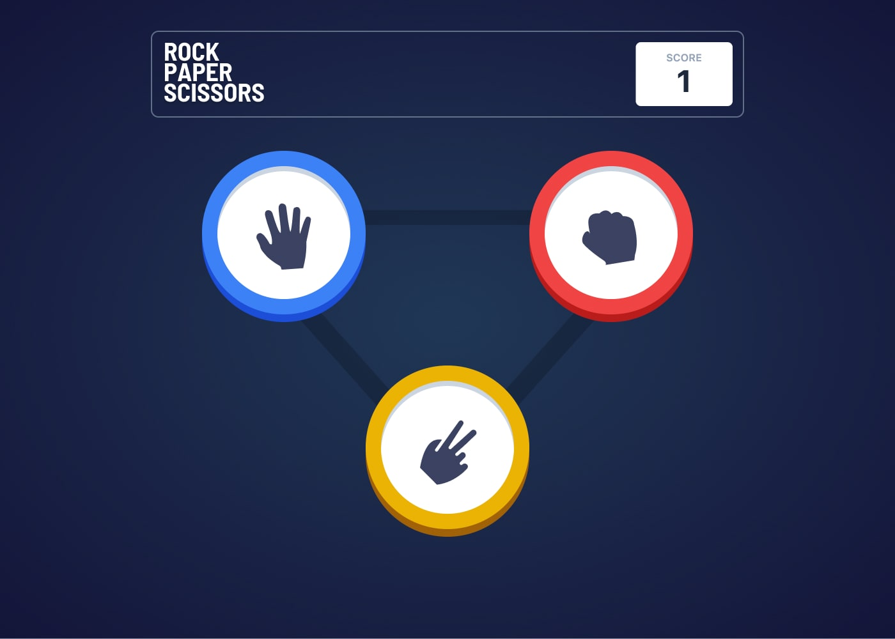

# Rock, Paper, Scissors

### Table of contents

- [Overview](#overview)
  - [The challenge](#the-challenge)
  - [Screenshot](#screenshot)
  - [Links](#links)
- [My process](#my-process)
  - [Built with](#built-with)
  - [What I learned](#what-i-learned)
  - [Continued development](#continued-development)
- [Author](#author)
- [Acknowledgments](#acknowledgments)

## Overview

### The challenge

Users should be able to:

- View the optimal layout for the game depending on their device's screen size
- Play Rock, Paper, Scissors against the computer
- Maintain the state of the score after refreshing the browser

### Screenshot



### Links

- Solution URL: [Add solution URL here](https://your-solution-url.com)
- Live Site URL: [Add live site URL here](https://your-live-site-url.com)

## My process

### Built with

- Semantic HTML5 markup
- Flexbox
- Desktop-first workflow
- [React](https://reactjs.org/) - JS library
- [Next.js](https://nextjs.org/) - React framework
- [tailwindcss](https://tailwindcss.com/) - For styles
- [Motion Framer](https://www.framer.com/motion/) - Animation Library

### What I learned

- How to properly render the exit animation when a component is dismounted / removed from the DOM.

```tsx
// Component used for exit animatins:
<AnimatePresence>
  {reveal ? (
    <motion.div
      // a delay is needed or else content will be shifted when the new component mounts
      // avoid using "mode='wait'" on <AnimatePresence>.
      exit={{ transition: { duration: 0.3 } }}></motion.div>
  ) : (
    <motion.div
      // delay needs to be longer than exit's duration
      animate={{ transition: { delay: 0.25 } }}></motion.div>
  )}
</AnimatePresence>
```

- Improved state patterns: replaced useEffect() and applied functions / actions directly to user events. (onClick).

- Avoided asynchronous events (setTimeout) and relied on Framer's `onAnimationComplete()`, to make sure the user's score is only shown AFTER the animation is complete.

- Triangle-based layouts are not for the faint of heart.

- Rendering SVGs fills with tailwindcss is not very intuitive. My solution was to use individual SVG functional components.

### Continued development

- Better use of Typescript
- Improve component naming conventions.
- Only use useEffect for data synchronization
-

### Useful resources

- This is a solution to the [Rock, Paper, Scissors challenge on Frontend Mentor](https://www.frontendmentor.io/challenges/rock-paper-scissors-game-pTgwgvgH)

## Author

- Website - [mikeshea.dev](https:mikeshea.dev)
- Twitter - [@ohhTHATmike](https://www.twitter.com/ohhthatmike)

## Acknowledgments
